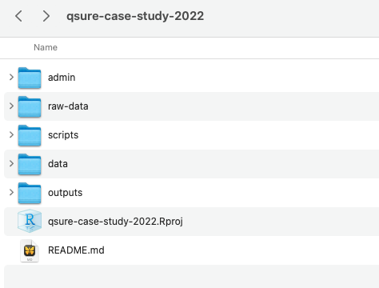

# Project Setup {background-color="#007CBA" style="text-align: center;"}


## Project Setup: Anatomy of a Project

:::: { .columns}

::: {.column width="50%"}

<p align="center"></p>

:::

::: {.column width="50%"}

-   Keep raw and processed data separate (`raw-data` vs. `data`)

-   Folder for `scripts`, ordered or labelled descriptively

-   Optionally have `admin` for project notes and `outputs` for final reports and figures

-   [**README**]{.emphasized} — text file that introduces and explains a project (`usethis::use_readme_md()`)

-   [**R Project (`.Rproj` file)**]{.emphasized} — tells RStudio all your files belong to one project and sets the working directory for the entire project

:::

::::


## Compute Environment Control

Make it easy for others (and future you) to re-run your code on any machine

:::: {.columns}

::: {.column width="50%"}

#### Virtual Environments

Isolate package versions per project so code runs the same everywhere

**Python — `venv` or `conda`:**
```bash
python -m venv .venv && source .venv/bin/activate
pip freeze > requirements.txt   # save
pip install -r requirements.txt # restore
```

**R — `renv`:**


You can commit & track `renv.lock` / `requirements.txt` / `environment.yml`

:::

::: {.column width="50%"}

#### Avoid Absolute File Paths

Hard-coded paths break on every other machine:

```r
# ❌ breaks on anyone else's computer
read.csv("~/Users/Whiting/Projects/data.csv")

# ✅ relative path from project root
read.csv("data/raw/data.csv")

# ✅ R: use here::here() for safety
read.csv(here::here("data", "raw", "data.csv"))
```

- Always use paths **relative to the project root**
- `here::here()` (R) and `pyprojroot.here()` (Python) find the project root automatically


:::

::::


## Analysis Plan First

**Write the plan before you write the code** - define your questions, methods, and outputs *before* touching data

**Why it matters:**

- Prevents [p-hacking]{.emphasized} — decisions made after seeing results inflate false positive rates
- Forces clarity on the research questions and makes collaboration easier 
- **Makes coding easier!!!!**

**What to include:**

- Research question, hypotheses, endpoints
- Cohort definition
- Statistical methods and model specifications (e.g how to handle missing data)
- Planned sensitivity analyses, expected outputs/tables/figures


## Setup Version Control

**Git** is version control software that runs locally on your computer

- Tracks every change made to your files over time, so you can revert to any previous version
- Work on experimental changes without breaking working code (branches)

**GitHub** is a cloud platform for hosting Git repositories

- Back up your code and git history remotely and collaborate with others on the same codebase
  
::: {.callout-tip}
Think of Git as "track changes" for your entire project, and GitHub as Google Drive — but for code and those documented changes
:::

## GitHub & GitHub Enterprise

:::: {.columns}

::: {.column width="50%"}

**GitHub**

- [www.github.com](https://www.github.com)
- Public website
- Individual repositories can be made public or private (only you or invited collaborators can see repo)

:::

::: {.column width="50%"}

**GitHub Enterprise (MSK)**

- [www.github.mskcc.org](https://www.github.mskcc.org)
- Behind the MSK firewall (need to be on VPN if not on MSK network)
- Login via MSK credentials
- Should be used for MSK projects
- Otherwise identical to github.com

:::

::::


## Set Up `.gitignore` Before Your First Commit

::: {.callout-warning}
**Deleting a file does not remove it from Git history.** If PHI or sensitive data is ever committed, it is a violation — even if you delete it in the next commit.
:::

A `.gitignore` file tells git which files to NOT track. Set it up *before* you commit anything. 

<br> 

Use `usethis::use_git_ignore()` in R or GitHub's [gitignore templates](https://github.com/github/gitignore) to get started quickly (but check where data resides and add as needed)

## `.gitignore` Example

```r 
# Data — never commit raw or sensitive data
data/
raw-data/
*.csv
*.xlsx

# Credentials and config
.env
*.key

# R-specific
.Rhistory
.RData
.Rproj.user/

# Python virtual environment (use requirements.txt instead)
.venv/
venv/

# Compiled bytecode
__pycache__/
*.pyc

# Jupyter notebook checkpoints
.ipynb_checkpoints/

# OS clutter
.DS_Store
```

