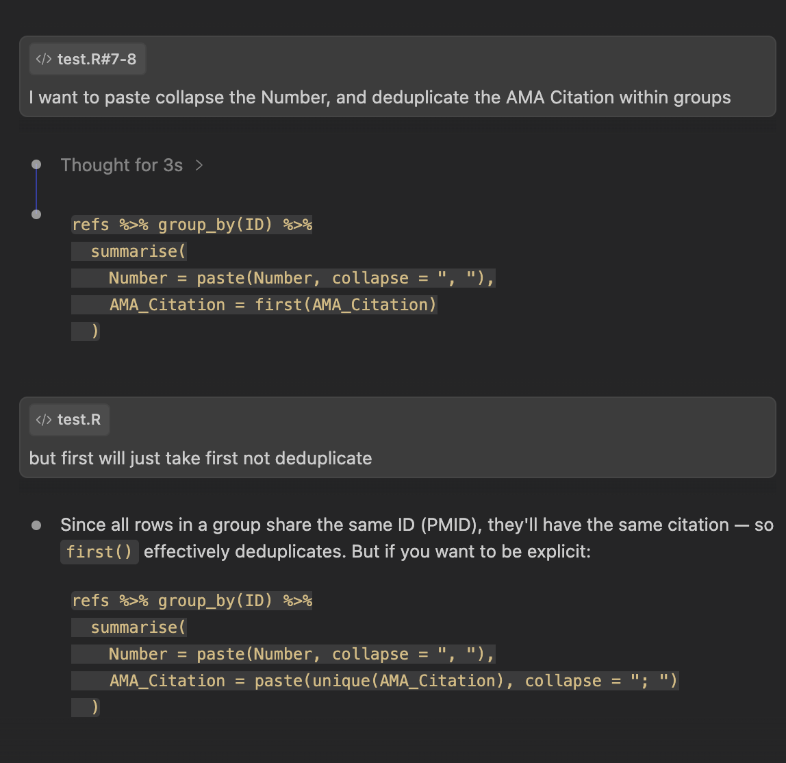

# AI Best Practices {background-color="#007CBA" style="text-align: center;"}


## AI in Coding: Opportunities & Risks

:::: {.columns}

::: {.column width="50%"}

**Pros**

- **Helps scaffold** - Speeds up boilerplate code and complex code pipelines
- Helps **translate** between R and Python
- **Debugging** 
- **Documentation** - Generates documentation and inline comments
- **Code review**

:::

::: {.column width="50%"}

**Cons**

- **PHI risk** 
- **Hallucinations** - AI confidently generates plausible but incorrect code
- **Reproducibility gap** — if you can't explain what the code does, you can't defend the analysis
- Outdated training data / limited knowledge of niche packages

:::

::::

::: {.callout-warning}
**MSK policy:** Use only approved institutional tools. These are currently web & browser based only.
:::


# Tips for Coding with AI ⚠️ {background-color="#007CBA" style="text-align: center;"}

## AI Tips: Stay Close to Code During Data QA

:::: {.columns}

::: {.column width="55%"}

Stay close to your code while preprocessing and QA-ing your data. AI cannot catch errors it doesn't know to look for.

<br> 

**❌ Don't** : Let an LLM QA your data or use unchecked variable cleaning code from an LLM without QA-ing it yourself.

**✅ Do** : Check variable types and levels, missingness, and ranges yourself before handing off to an AI tool. **Make sure you understand every variable needed to execute the analysis plan**

:::

::: {.column width="45%"}

<p align="center"></p>

:::

::::


## AI Tips: Don't Outsource Your Statistical Judgment

::: {.fragment}
**❌ Don't** : Let an LLM pick the most appropriate statistical test or models for your analysis.

**✅ Do** : Get help with syntax, but make the decisions yourself. If you don't understand why a test or model is appropriate for your data and question, see if the LLM can help explain it to you in simple terms (I've had varying success with this last point).
:::

<br> 

::: {.fragment}
**❌ Don't** : Let an LLM write a statistical plan for you.

**✅ Do** : Let an LLM clean up and format a statistical plan you've already written. Ask it to review it for gaps or inconsistencies, but make sure you understand and can defend every decision in the plan yourself.
:::


## AI Tips: Think Systematically

<br>

**❌ Don't** : Tell an LLM to produce a figure based on a dataset you input. 


**✅ Do** : Provide context on the structure of your data (which variables you want to use), and the specifications of the plot you would like to make. Then, ask it to generate readable and well-commented code to produce the plot, and explain the code to you line by line. 


## AI Tips: Think Systematically — Example

::::{.columns}

:::{.column width="50%"}
**❌ Vague prompt:**

> *"Here is my dataset. Make a survival curve."*

- LLM has to guess variable names, event coding, grouping variable
- Output may use wrong packages or defaults
- Hard to verify or adapt the code you get back

:::

:::{.column width="50%"}
**✅ Specific prompt:**

> *"I have a data frame `trial` with: `ttdeath` (time to death in months), `death` (1 = event, 0 = censored), `trt` ('Drug A' / 'Drug B'). Using `{survival}` and `{ggsurvfit}`, write well-commented R code to plot Kaplan-Meier curves by treatment group with a risk table. Then explain each step."*

- LLM produces code you can read and verify
- Explanation helps you catch mistakes and learn
- You stay in control of the analytical decisions

:::

::::

## AI Tips: Don't Let Your Code Base Get Away From You


**❌ Don't** : Let AI take over your codebase without understanding and verifying every line of code it produces.

**✅ Do** : Use AI to scaffold, debug, and explain code. Use it to help organize, functionalize and modularize your code (eg. helping with the 'do not repeat 3 times' rule)

::: {.callout-warning}
You are still responsible for understanding and maintaining this codebase. Stay in control — treat AI suggestions like code review, not ground truth.
:::

## Example: AI-Assisted Pipeline Review

Ask AI to review your code systematically — bugs, performance, and structure all at once

::: {.callout-tip}
Prompt: *"Review this pipeline for bugs, efficiency and parameter consistency across scripts. Suggest areas to speed up the code. List findings by priority and suggest specific fixes with file and line references."*
:::

```{.md}
# Pipeline Review: run-pipeline.R and Related Scripts

## Findings

### Bugs / Errors

- Sequential bootstrap loop — parallel cluster is set up but never used
  Fix: Replace `for` loop in `run_bootstrap()` with `foreach %dopar%`

- `prep-data.R` uses hardcoded parameters duplicated from `run-pipeline.R`
  Fix: Source shared parameters from a single config file

- Pipeline assumes `data/model-data.RData` exists — fails with cryptic error if missing
  Fix: Check if file exists; source `prep-data.R` first if not

- Potential syntax bug in `preprocess-functions.R` line ~57: `[, , drop = FALSE]`
  Fix: Verify intent and replace with proper indexing

### Performance Improvements

1. Parallelize the bootstrap loop (biggest gain) — swap `for` → `foreach %dopar%`
2. Batch file writes — collect rows during loop, write once at the end
3. Replace `do.call(cbind, ...)` with `dplyr::bind_cols()` — faster for wide data

### Verification Plan

- Run local mode with NBOOT=5, confirm no errors end-to-end
- Confirm parallelized and sequential bootstrap give same AUC distributions (same seed)
- Unit test the indexing fix on a small data slice
```


## Other AI Tips

::: {.incremental}
- **✅ Do** : Use AI to write documentation
- **✅ Do** : Use AI for code review and improving code efficiency
- **✅ Do** : Use context/project/skill files to specify style, preferred packages, compute constraints, etc.
- **✅ Do** : Input cluster guidelines as context for cluster computing scripts
- **✅ Do** : Use Plan mode and iterate several times for larger code refactors
- **✅ Do** : Use it to build/organize larger pipelines, but make sure you understand which code/functions depend on which scripts, etc.
:::


