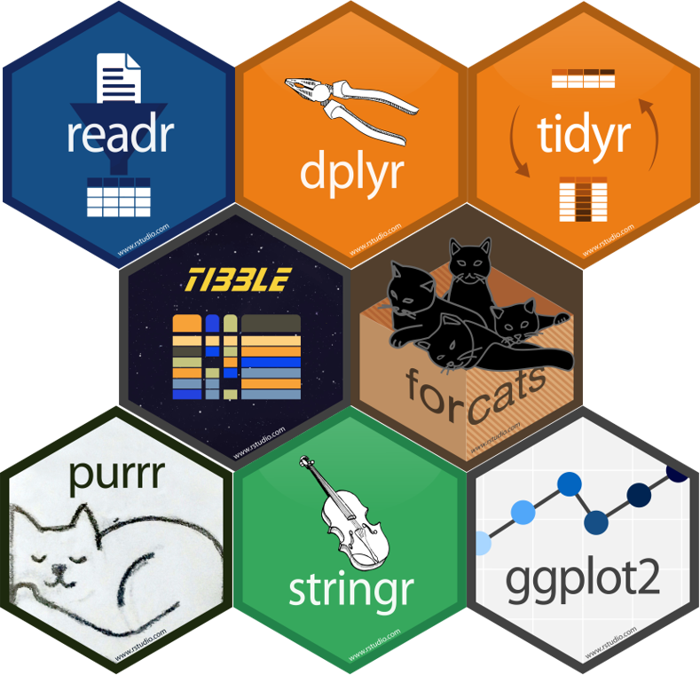
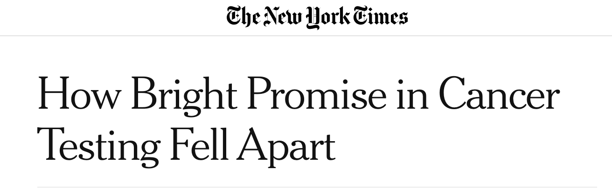
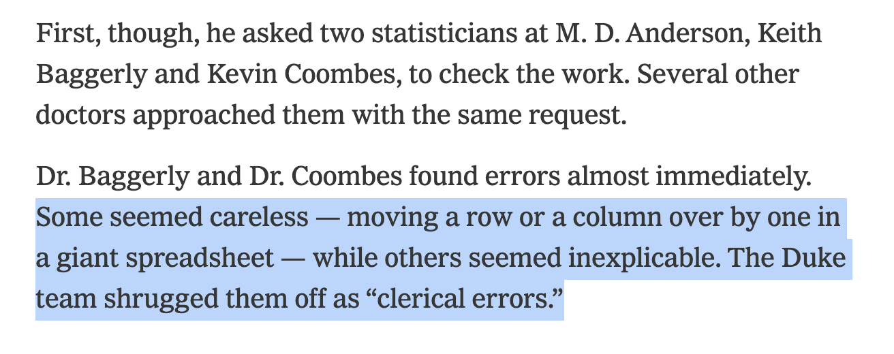
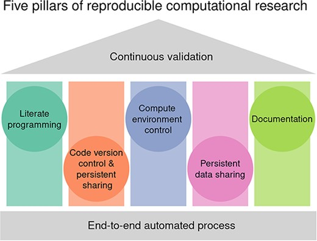

---
format: 
  revealjs: 
    theme:  [default, style.scss]
    transition: fade
    slide-number: true
execute:
  echo: true 
  output: asis
  error: true
editor: source
--- 

```{r}
#| echo: false
#| error: false
#| warning: false

#knitr::opts_chunk$set(echo = TRUE, results = 'asis')

library(tidyverse)
library(gtsummary)

sm_trial <-
  trial %>% 
  select(trt, age, grade, response)


# knit_print.gtsummary <- function(x, ...) {
#    gtsummary::as_gt(x) |>
#      gt::as_raw_html()
# }
# 
# knit_print.gt_tbl <- function(x, ...) {
#   gt::as_raw_html(x)
# } 
# 
# 
# registerS3method("knit_print", "gtsummary", knit_print.gtsummary)
# registerS3method("knit_print", "gt_tbl", knit_print.gt_tbl)

# fill for font awesome icons
fa_fill <- "#606060"
```

# Computational Reproducibility <br> in Practice {background-color="#007CBA" style="text-align: center; font-size: 0.8em;"}


Karissa Whiting <br> 
June 1st, 2026 <br><br>
Summer Training Series <br> 
Memorial Sloan Kettering <br>


<p align="center"></p>


<br>

`r fontawesome::fa("twitter", fill = "white")` [[\@karissawhiting](https://twitter.com/karissawhiting)]{style="color: white"}

`r fontawesome::fa("github", fill = "white")` [[github.com/karissawhiting](https://github.com/karissawhiting/)]{style="color: white"}


## What is Reproducibility?

::: incremental

A data analysis is [reproducible]{.emphasized} if all the information (data, files, etc.) needed to compute results is available for someone else to re-do your entire analysis and get the same results. 

- All data processing steps from `raw data` to `cleaned data` are available and documented

- All analysis decisions made are documented and available in code

- Results don't depend on your specific computational environment (e.g. no hard coded file paths, seeds set for stochastic computations)

:::

## Why is Reproducibility Important?

::: incremental

- Allows you to show evidence of your results

- Encourages transparency about decisions made during analysis

- Enables others to check and use/extend your methods and results

- Enables FUTURE YOU to check and use/extend your methods and results


***"You mostly collaborate with yourself, and me-from-two-months-ago never responds to email"***

~ *Dr. Mark Holder, Computational Biologist*

:::

## Why is Reproducibility Important?


Dangers of writing code that is hard to double-check or confirm:

- [The New York Times](https://www.nytimes.com/2011/07/08/health/research/08genes.html?_r=0)

<p align="center"></p>
<p align="center"></p>


## Journal Code-Sharing Requirements

Increasingly, journals and funders require code to be submitted or shared. You may be asked to provide your cleaned analysis data (and possibly code) at time of publication or end of a grant.

::: {style="font-size: 0.75em;"}

| Journal / Publisher | Requirement |
|---|---|
| **NIH** | As of Jan 2023, all grants require a Data Management Plan; sharing of data and code may be required at publication or grant end.|
| **The BMJ** | Submissions ≥ May 2024: code used to analyze data must be submitted |
| **PLOS Biology/Medicine** | Submissions ≥ Jan 2026: author-generated code directly related to findings must be available publicaly |
| **Nature / Springer Nature** | Code Availability Statement required; sharing is a condition of publication |


:::

::: {.callout-tip}
Requirements vary by journal, article type, and whether code is essential to reproduce findings. Even when not required, sharing code is increasingly expected.
:::

## Five Pillars Of Reproducibility


<p align="center"></p>

::: aside
<https://pubmed.ncbi.nlm.nih.gov/37870287/>
:::


## How Do We Ensure Our Code is Reproducible?


- [Compute Environment Control]{.emphasized}
  - Virtual environments, avoid absolute file paths (e.g. `~/Users/Whiting/Projects...`) 

- [Code Version Control]{.emphasized}
  - Document changes you make, or use git/Github

- [Documentation]{.emphasized}
  - Comment and document your code
  - Invest in a good `README.md`

- [Data Integrity]{.emphasized} - more details later

- [Literate Programming]{.emphasized}
  - Have a clear project structure, avoid 'by hand' steps









# Thank You!!!

[Questions?]{.large}

## Resources

- {biostaR} - <https://github.mskcc.org/pages/datadojo/biostatR/index.html>
- {gtsummary} - <https://www.danieldsjoberg.com/gtsummary/>
- {bstfun} - <https://www.danieldsjoberg.com/bstfun/index.html>
- Departmental Resource Guide - <https://rconnect.mskcc.org/resource-guide/>
- Quarto Docs - <https://quarto.org/docs/guide/>
- Quarto Blog Post by Alison Hill - <https://www.apreshill.com/blog/2022-04-we-dont-talk-about-quarto/>

